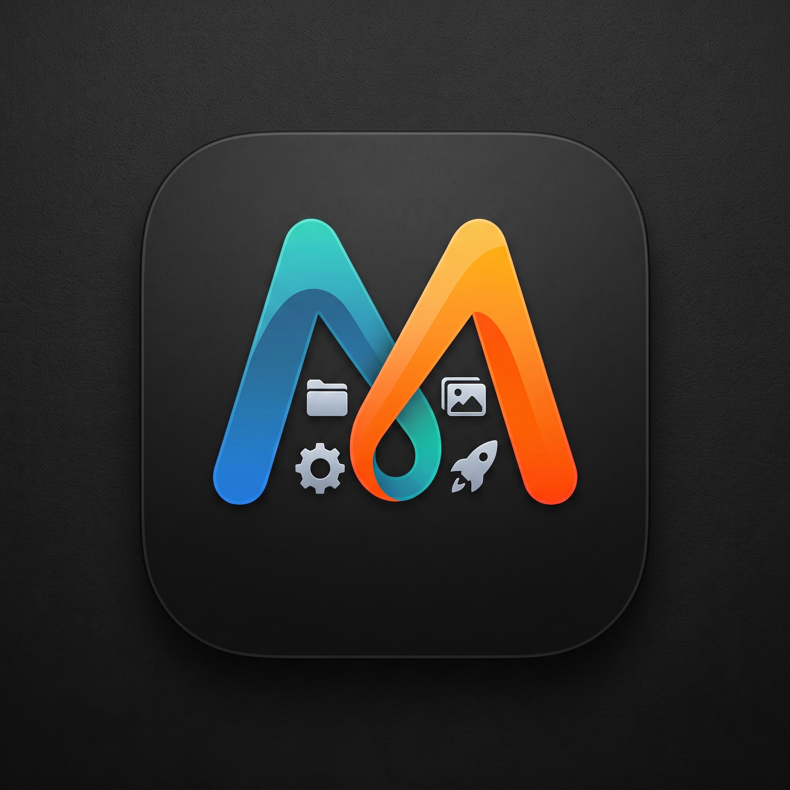

<div align="center">
  
  <h1>MCons</h1>
  <h3>Icons for MacOS</h3>

  <p>A native macOS utility for creating folders with custom icons. Built with <b>Swift 6</b> and <b>SwiftUI</b>.</p>

  <p>Developed by <b>Neel0210</b></p>

  <p>
    
    
    
  </p>

  <p>
    <a href="https://t.me/MConsOfficial">📢 <b>Telegram Channel (@MConsOfficial)</b></a> &nbsp;|&nbsp; 
    <a href="https://t.me/MConsupport">💬 <b>Telegram Support Group (@MConsupport)</b></a>
  </p>
</div>

## Features

- 🎨 **Premium Icon Packs** — Beautifully rendered folder icons across custom themes
- 📁 **Create & Style** — Create new folders and apply icons in one flow
- 🖱️ **Drag & Drop** — Drop folders directly onto the app to customize them
- ✏️ **Folder Renaming** — Option to rename target folder or keep original name
- ↩️ **Cmd+Z Undo** — Full undo/redo support for folder renames and icon changes
- 🖼️ **Custom Import** — Use your own SVG, PNG, JPG, or ICNS files as folder icons
- 🔄 **Reset to Default** — One-click restore to macOS default folder icon
- 🌙 **Dark Mode** — Full dark and light mode support
- ⚡ **Native Performance** — Built with SwiftUI for instant, fluid interactions

## Icon Packs

| Pack | Theme | Icons | Format |
|:---|:---|:---:|:---:|
| 🌙 **Dark Mode Pro** | Matte black with neon accents | 12 | Vector (CoreGraphics) |
| 🍎 **macOS Native+** | Enhanced Apple system colors | 12 | Vector (CoreGraphics) |
| ⚔️ **Demon Slayer** | Kimetsu no Yaiba Hashira & Demon icons | 10 | 1024×1024 SVG |
| 🏴‍☠️ **One Piece** | Straw Hat Pirates & legendary pirate icons | 10 | 1024×1024 SVG |
| 🗡️ **Solo Leveling** | Shadow Monarch & shadow army icons | 10 | 1024×1024 SVG |
| ⚡ **Pokémon** | Legendary & iconic Pokémon custom folder icons | 10 | 1024×1024 SVG |

## Adding Custom Icon Packs & Icons

Want to add your own custom icon packs to MCons? Follow this simple guide:

### 1. Icon Specifications
- **Recommended Size**: **512×512** or **1024×1024** pixels (1:1 square ratio)
- **Supported Formats**: `.svg` (recommended vector format), `.png` (transparent background), `.jpg`, `.icns`, or `.tiff`
- **Color Profile**: sRGB or Display P3 with alpha channel

### 2. File Location
Create a subfolder for your pack inside `MCons/Resources/IconPacks/`:

```
MCons/Resources/IconPacks/my-pack/
├── metadata.json
├── Icon1.png
├── Icon2.png
└── Icon3.png
```

### 3. Add `metadata.json`
Inside your pack folder, add a `metadata.json` file:

```json
{
    "id": "my-pack",
    "name": "My Custom Pack",
    "description": "My awesome custom folder icons",
    "emoji": "🎨",
    "accentColorHex": "#6C5CE7"
}
```

### 4. How to Wire Them Up
No Swift code changes are needed! The dynamic `IconPackLoader` scans all pack folders automatically:
1. Run `./build_app.sh` (or `swift build`)
2. Launch MCons — your new icon pack will automatically appear in the **Icon Packs** tab!

- macOS 14.0 (Sonoma) or later
- Apple Silicon or Intel Mac

## Build & Run

### Quick Start (Debug)
```bash
swift build
.build/debug/MCons
```

### Release Build (App Bundle)
```bash
chmod +x build_app.sh
./build_app.sh
open "output/MCons.app"
```

### Open in Xcode
The project includes both a `Package.swift` (for SPM) and an `.xcodeproj` (generated with XcodeGen):
```bash
# Regenerate the Xcode project
xcodegen generate

# Open in Xcode
open MCons.xcodeproj
```

## Project Structure

```
MCons/
├── App/                        # Entry point & AppState (MConsApp.swift)
├── Features/
│   ├── Home/                   # Dashboard & ContentView
│   ├── IconPacks/              # Browse & select icons
│   ├── IconApply/              # Apply workflow
│   └── Settings/               # Preferences
├── Core/
│   ├── Services/               # IconService, FolderService, IconPackLoader
│   ├── Models/                 # IconPack, FolderIcon, AppFolder
│   ├── Extensions/             # Color hex, NSImage, View modifiers
│   └── Theme/                  # Design tokens & animations
└── Resources/
    ├── Assets.xcassets/        # App icon & colors
    └── IconPacks/              # Bundled icon pack images
```

## How It Works

**MCons - Icons for MacOS** uses Apple's native `NSWorkspace.setIcon(_:forFile:options:)` API to set custom icons on folders. This is the official, Apple-sanctioned method that:

- Works reliably across all macOS versions
- Persists across reboots
- Shows in Finder, Dock, and Spotlight
- Can be reset cleanly

The app renders folder icons programmatically using Core Graphics when bundled images aren't available, creating beautiful colored folder shapes with proper shadows and highlights.

## Credits & Disclaimers

All custom icon packs and character artwork featured in MCons remain the intellectual property of their respective creators and copyright owners:

- **⚡ Pokémon**: Characters, names, and related indicia are trademarks and copyright of **© Nintendo / Creatures Inc. / GAME FREAK inc. / The Pokémon Company**.
- **⚔️ Demon Slayer (*Kimetsu no Yaiba*)**: Characters, names, and artwork are copyright of **© Koyoharu Gotouge / SHUEISHA / Aniplex / ufotable**.
- **🏴‍☠️ One Piece**: Characters, names, and artwork are copyright of **© Eiichiro Oda / SHUEISHA / Toei Animation**.
- **🗡️ Solo Leveling (*Na Honjaman Rebeleob*)**: Story by **Chugong**, Art by **DUBU (REDICE STUDIO)**, Published by **D&C Media / KakaoPage / A-1 Pictures**.

> **Disclaimer:** MCons is a free, non-commercial open-source utility designed for personal desktop customization. All themed icon assets are provided for personal aesthetic enhancement.

## License

MIT License — see [LICENSE](LICENSE) for details.

## Author

Developed by **Neel0210** ❤️

